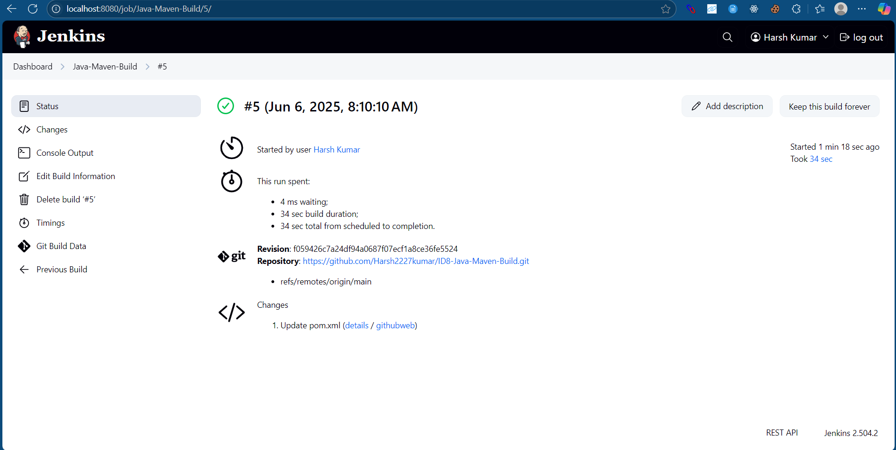

# ✅ Task 8: Java Maven Build with Jenkins

This task was part of my DevOps internship where I set up a simple CI/CD workflow using **Jenkins** and **Maven** to build a basic Java project.

---

## 🚀 What I Did

- Created a simple **Java HelloWorld** application using Maven.
- Created the required `pom.xml` with Java 8 compatibility (`<source>1.8</source>`).
- Installed Jenkins on my **Windows machine using Docker**.
- Installed Maven 3.9.10 using **Jenkins Global Tool Configuration**.
- Created a **Freestyle Jenkins job**:
  - Pulled the code from this GitHub repository.
  - Used the build step: `Invoke top-level Maven targets` with goal `clean package`.
- Ran the job and verified the output with **`BUILD SUCCESS`** in the Jenkins console.

---

## 📂 Project Structure

```
ID8-Java-Maven-Build/
|   .gitignore
|   console.log
|   pom.xml
|   README.md
|   Screenshot1.png
|   Screenshot2.png
|
+---.idea
|       .gitignore
|       compiler.xml
|       encodings.xml
|       jarRepositories.xml
|       misc.xml
|       workspace.xml
|
+---.mvn
\---src
    +---main
    |   +---java
    |   |   |   HelloWorld.java
    |   |   |
    |   |   \---org
    |   \---resources
    \---test
        \---java

```
---

## 🧪 Tools & Technologies Used

| Tool       | Purpose                        |
|------------|--------------------------------|
| Jenkins    | CI/CD automation               |
| Maven      | Java project build tool        |
| Java 1.8   | Application runtime            |
| Docker     | Running Jenkins on Windows     |
| Git & GitHub | Source code management       |

---

## 📸 Screenshot

> Successful build log from Jenkins console output:

 .
 .

---

## 🧠 What I Learned

- How Jenkins builds Java code using Maven.
- Difference between `compile` and `package` goals.
- How to configure tools (Maven, JDK) in Jenkins.
- How to debug common build errors like invalid Java versions.
- Basic CI/CD pipeline workflow using Jenkins freestyle jobs.

---

## 🔗 GitHub Repository

This project is available at:  
👉 **[https://github.com/Harsh2227kumar/ID8-Java-Maven-Build](https://github.com/Harsh2227kumar/ID8-Java-Maven-Build)**

---
